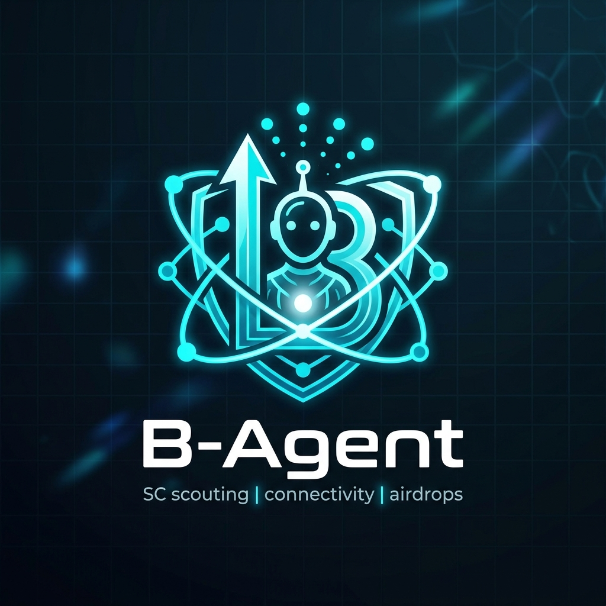

<p align="center">
  
</p>

# B-Agent Airdrop & Arbitrage

A powerful Smart Contract agent that scouts for opportunities across multiple blockchains using a custom **Conditional Rubric**.

## Features

- **Multi-Chain Scout**: Iterates through Ethereum, Arbitrum, Polygon, and Base.
- **Conditional Rubric**: Evaluates protocols based on:
  - **x**: Minimum Volume ($1000+)
  - **y**: Minimum Transaction Count (50+)
  - **z**: Minimum Protocol Age (30 days+)
- **Flashloan Arbitrage**: Detects price discrepancies and calculates profitability (Target > 2%).
- **Security Sieve**: Advanced analysis of:
  - **Admin Key Status**: Verifies if contract ownership is renounced.
  - **Transferability**: Ensures tokens are not locked or restricted (honeypot detection).
- **Personalized AI Agent**: Connect your wallet to analyze your transaction history for context-aware opportunities.
- **Reporting Engine**: Generates comprehensive markdown reports on scouting outcomes.

## Tech Stack

- **Runtime**: Bun
- **Frontend**: Vite + React
- **Blockchain**: Ethers.js v6
- **Styling**: Premium Vanilla CSS (Glassmorphism)

## Setup

1. **Install Dependencies**:
   ```bash
   bun install
   ```
2. **Environment Variables**:
   Copy `.env.example` to `.env` and add your Ankr RPC key:
   ```bash
   cp .env.example .env
   ```
   Chain-specific `VITE_*_RPC` values are optional overrides. If they are blank, the app derives RPC URLs from `VITE_ANKR_API_KEY`.
3. **Run Locally**:
   ```bash
   bun dev
   ```

## Decision Making Rubric

The agent uses a scoring system to interpret "Success" or "Failure":

| Metric | Threshold | logic |
| --- | --- | --- |
| Volume (x) | > $1000 | Required for Airdrop |
| Tx Count (y) | > 50 | Required for Airdrop |
| Age (z) | > 30 Days | Required for Airdrop |
| Arbitrage | > 2% | Independent Success |

## Action Logs

All actions generate a report. Success triggers a high-priority flag, while failures are logged with detailed missing criteria.
